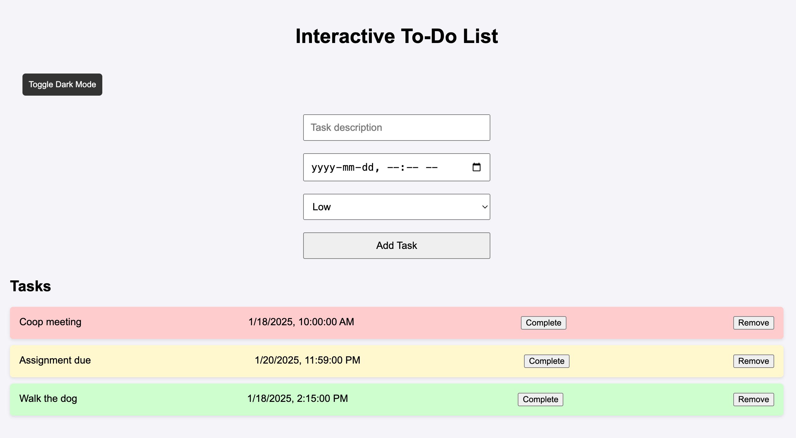

# 📋 Task Manager

An interactive and user-friendly To-Do List Web Application built with HTML, CSS, and JavaScript that allows users to manage tasks efficiently. This application supports adding tasks with due dates and priorities, marking tasks as complete, removing tasks, drag-and-drop reordering, and dark mode functionality.

## Features

- ✅ Add Tasks with descriptions, due dates, and priority levels (High, Medium, Low)
- 🗑 Remove Tasks individually
- ✔ Mark Tasks as Completed
- 🌓 Toggle Dark Mode for better user experience
- 🔔 Due Date Notifications for upcoming tasks
- 📦 Local Storage support (tasks persist after refreshing the page)
- ↕ Drag-and-Drop Reordering for task prioritization

## 🖼 Demo

## 🔧 Usage
1. Enter a task description.
2. Select a due date and priority level.
3. Click "Add Task" to add it to your task list.
4. Click "Complete" to mark a task as done or "Remove" to delete it.
5. Use the "Toggle Dark Mode" button to switch between light and dark themes.
6. Drag and drop tasks to reorder them.
7. Receive notifications when tasks are close to their due dates.
## 🛠 Built With
- HTML5 – Structure
- CSS3 – Styling and Dark Mode
- JavaScript – Functionality and Interactivity

## 🚀 Requirements

- A modern web browser (Chrome, Firefox, Edge, Safari)
- Live Server extension in VS Code (optional, for live preview)

